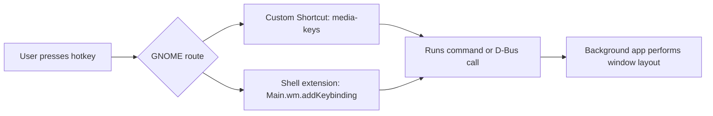

**Great idea. This is doable, but on GNOME/Wayland there are constraints: true “global” hotkeys are tightly controlled by the shell.**

---

## High‑level strategy (Ubuntu 24+, GNOME 46+)

- Clear existing GNOME bindings that conflict with the keys you want (via GSettings).
- Register your own actions as “Custom Shortcuts” via org.gnome.settings-daemon.plugins.media-keys so GNOME Shell will invoke a command when the hotkey is pressed. This is the standard, supported way to get globally recognized hotkeys. Custom shortcuts live under a relocatable schema and are listed in the custom-keybindings array.【turn12find0】【turn5fetch1】
- Optionally: if you want richer in-shell integration (e.g., moving windows directly), implement a GNOME Shell extension that adds its own keybindings via Main.wm.addKeybinding (global, per‑user). This works on both X11 and Wayland because it runs inside the shell.【turn10fetch0】

For a window-layouter that works out-of-the-box, the cleanest combo is:
- A background GTK app/service that performs the layouts and exposes a simple D-Bus API.
- Custom shortcuts that invoke a CLI tool/dbus-send to trigger those layouts.
- Optionally, a Shell extension for tighter integration or even more robust global handling.

Here’s the flow in a diagram:



Below I’ll break down the concrete steps, schemas, and gotchas.

## 1. Where GNOME stores keybindings

GNOME stores keybindings in several GSettings schemas under dconf. The main ones you’ll care about:

- Window manager bindings (move/resize, tile, workspaces): org.gnome.desktop.wm.keybindings【turn12find0】
- Shell-specific bindings (dock app switching, etc.): org.gnome.shell.keybindings【turn6fetch0】
- Tiling window shortcuts (Mutter-level): org.gnome.mutter.keybindings (e.g., toggle-tiled-left/right)【turn3find0】
- Media/global-style shortcuts and “Custom Shortcuts”: org.gnome.settings-daemon.plugins.media-keys【turn12find0】
- Power button keys: org.gnome.settings-daemon.plugins.power (less relevant here)【turn12find0】

GNOME also ships mapping files under /usr/share/gnome-control-center/keybindings/ that show how these logical names map to the WM’s settings.【turn12find0】

## 2. Clearing conflicts (e.g., Super+Ctrl+1, Super+Left)

You typically don’t “override” in-place; you clear the conflicting binding(s) and then register your own elsewhere.

### 2.1 Super+Ctrl+1 conflicts

By default, Super+Number shortcuts are often bound to “switch-to-application-$i” (dock app switching) in org.gnome.shell.keybindings. To unbind those, you can set them to an empty array:

- Example (shell):
  ```bash
  for i in {1..9}; do
    gsettings set org.gnome.shell.keybindings switch-to-application-$i "[]"
  done
  ```
  【turn6fetch0】

There may also be window-manager bindings for workspace switching under org.gnome.desktop.wm.keybindings (e.g., switch-to-workspace-$i); check what’s present:

- List relevant WM bindings:
  ```bash
  gsettings list-recursively org.gnome.desktop.wm.keybindings | grep -E 'switch-to-workspace-[0-9]'
  gsettings list-recursively org.gnome.desktop.wm.keybindings | grep -E 'switch-to-application-[0-9]'
  ```

If any of those use your target combos, set them to "[]" or adjust them similarly.

### 2.2 Super+Left / Super+Right conflicts

Two sources of conflict:

- Mutter’s own tiling bindings in org.gnome.mutter.keybindings:
  - toggle-tiled-left / toggle-tiled-right (can include Super+Left/Right and Ctrl+Super+Left/Right)【turn3find0】
- Ubuntu Tiling Assistant extension (if installed), which can bind Super+Left/Right independently【turn11fetch0】.

Check the Mutter bindings:

```bash
gsettings list-recursively | grep -E 'toggle-tiled'
```

On some systems you’ll see something like:

- org.gnome.mutter.keybindings toggle-tiled-left ['<Super>Left', '<Primary><Super>Left']
- org.gnome.mutter.keybindings toggle-tiled-right ['<Super>Right', '<Primary><Super>Right']【turn3find0】

To free Super+Left and Super+Ctrl+Left, set those to only the bindings you want (or to "[]" to unbind):

- Example:
  ```bash
  gsettings set org.gnome.mutter.keybindings toggle-tiled-left "['<Super>Left']"
  gsettings set org.gnome.mutter.keybindings toggle-tiled-right "['<Super>Right']"
  ```
  (Or "[]" if you don’t want tiling on those keys at all.)【turn3find0】

Ubuntu 24.x also includes “Ubuntu Tiling Assistant” in some installs; if present, its own keybindings for Super+Left/Right can conflict. Users report that disabling that extension removes those bindings.【turn11fetch0】

## 3. Registering your own globally-recognized hotkeys (Recommended path: Custom Shortcuts)

On GNOME, the intended way to add new global shortcuts is to create “Custom Shortcuts”. These live under the relocatable schema:

- org.gnome.settings-daemon.plugins.media-keys.custom-keybinding
  - Keys: name, command, binding (the accelerator string)【turn5fetch1】
- And a list of custom entries at:
  - org.gnome.settings-daemon.plugins.media-keys : custom-keybindings (an array of paths)【turn12find0】

GNOME Settings (Keyboard → View and Customize Shortcuts → Custom Shortcuts) is just a UI over this. You can manipulate it via gsettings or directly via Gio.Settings from your app.【turn12find0】【turn5fetch1】

### 3.1 Adding a custom shortcut from the CLI (example)

Suppose you want Super+Ctrl+1 to run a CLI helper that applies a saved window layout.

- Define a unique ID for the shortcut, e.g. custom0 (or a hash of your app id + action).

- Set name, command, and binding:

  ```bash
  BASE="/org/gnome/settings-daemon/plugins/media-keys/custom-keybindings/custom0"

  gsettings set org.gnome.settings-daemon.plugins.media-keys.custom-keybinding:$BASE name "My Layout 1"
  gsettings set org.gnome.settings-daemon.plugins.media-keys.custom-keybinding:$BASE command "my-layout-tool --layout 1"
  gsettings set org.gnome.settings-daemon.plugins.media-keys.custom-keybinding:$BASE binding "<Primary><Super>1"
  ```

- Add this path to the custom-keybindings list (extending any existing entries):

  ```bash
  OLD=$(gsettings get org.gnome.settings-daemon.plugins.media-keys custom-keybindings)
  NEW=$(echo "$OLD" | sed -e "s/]/, '$BASE']/" -e "s/^'/[/'" -e "s/\[\],/['$BASE',]/")
  gsettings set org.gnome.settings-daemon.plugins.media-keys custom-keybindings "$NEW"
  ```

This pattern matches documented examples and tutorials for adding custom bindings via gsettings.【turn5fetch1】【turn13search3】【turn13search9】

Notes:

- Modifier names in binding strings:
  - <Primary> = Control
  - <Super> = Windows/Command key
  - <Shift>, <Alt>, etc.
- Binding strings are parsed by GTK’s accelerator parser; multiple accelerators per action are represented as an array of strings. Custom bindings typically store a single string.

### 3.2 Making custom shortcuts “globally recognized”

Once added via org.gnome.settings-daemon.plugins.media-keys, these shortcuts are handled by gnome-settings-daemon’s media-keys plugin and are global (they don’t require your app to have focus). The “command” can be:

- A CLI tool that:
  - Calls your background service over D-Bus (recommended), or
  - Talks directly to GNOME Shell over D-Bus to move windows (e.g. using org.gnome.Shell.Eval, but that’s fragile and not recommended).

Example: a tiny CLI my-layout-helper:

```bash
#!/bin/sh
dbus-send --session --dest=org.example.MyLayouter \
  --type=method_call /org/example/MyLayouter \
  org.example.MyLayouter.ApplyLayout string:"$1"
```

Then your custom binding’s command is:

my-layout-helper 1

This approach works reliably on both X11 and Wayland because the hotkey is interpreted by the shell/media-keys daemon, not by an app trying to grab keys.

## 4. Optional but powerful: GNOME Shell extension for global hotkeys

If you want your logic to run in-process inside GNOME Shell (for direct window manipulation or high reliability), write a Shell extension and use Main.wm.addKeybinding. This is how many tiling/keyboard-driven extensions (like Pop Shell) operate.

- The API:

  ```js
  Main.wm.addKeybinding(
      keyName,      // string name used in schema
      settings,     // a Gio.Settings object for your extension’s schema
      Shell.ActionMode.NORMAL,  // when the binding is active
      handler       // callback function
  );
  ```

- This was confirmed in a 2024 GNOME Discourse thread, with a snippet showing usage in extension.js.【turn10fetch0】

Typical pattern:

- In your extension’s GSettings schema, define key names like toggle-layout-1 with type 's' and default '<Primary><Super>1'.
- In enable():
  - Create a Gio.Settings for your schema.
  - Call Main.wm.addKeybinding for each key, passing a handler that calls your layout logic.
- In disable():
  - Use Main.wm.removeKeybinding (or analogous) to clean up.

This gives you true global hotkeys that are not dependent on a CLI command and lets you manipulate windows via Shell’s JS APIs (Meta.Window, global.display, etc.). The tradeoff is that you must distribute as a Shell extension.

## 5. How to manage GSettings from your app (without spawning gsettings)

Preferably, your app shouldn’t shell out to gsettings. Use the GIO API directly (Gio.Settings in C or its bindings in other languages).【turn15search3】

Example in C (pseudo):

- Create a GSettings object for the schema you want to change:

  ```c
  GSettings *media_keys = g_settings_new ("org.gnome.settings-daemon.plugins.media-keys");
  ```

- For string-array keys like custom-keybindings, use:

  ```c
  const gchar *old[] = { "/path/one/", NULL };
  const gchar *new[] = { "/path/one/", "/path/two/", NULL };
  g_settings_set_strv (media_keys, "custom-keybindings", new);
  ```

- For relocatable schemas (custom bindings), construct a settings object with a path:

  ```c
  GSettings *custom = g_settings_new_with_path (
      "org.gnome.settings-daemon.plugins.media-keys.custom-keybinding",
      "/org/gnome/settings-daemon/plugins/media-keys/custom-keybindings/custom0/"
  );

  g_settings_set_string (custom, "name", "Layout 1");
  g_settings_set_string (custom, "command", "my-layout-tool --layout 1");
  g_settings_set_string (custom, "binding", "<Primary><Super>1");
  ```

Analogous APIs exist in Python
